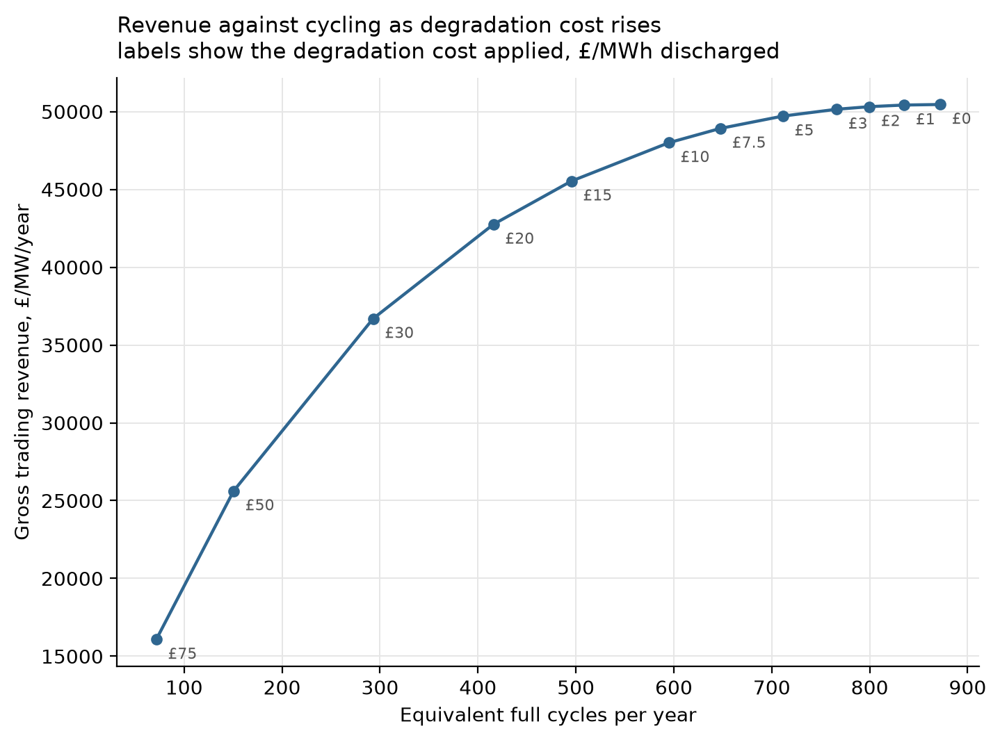
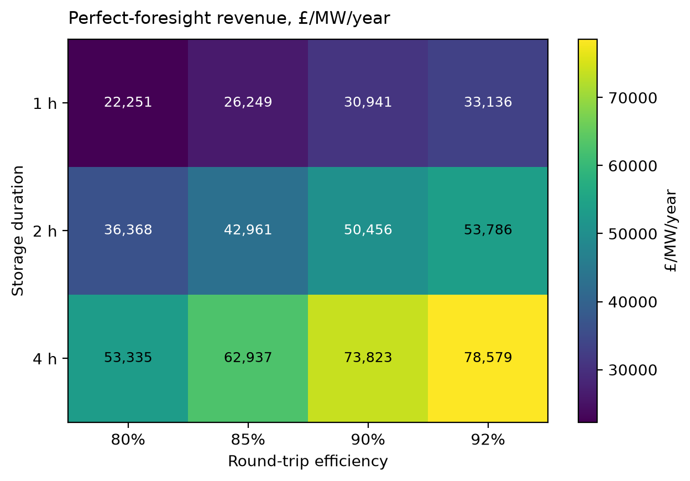
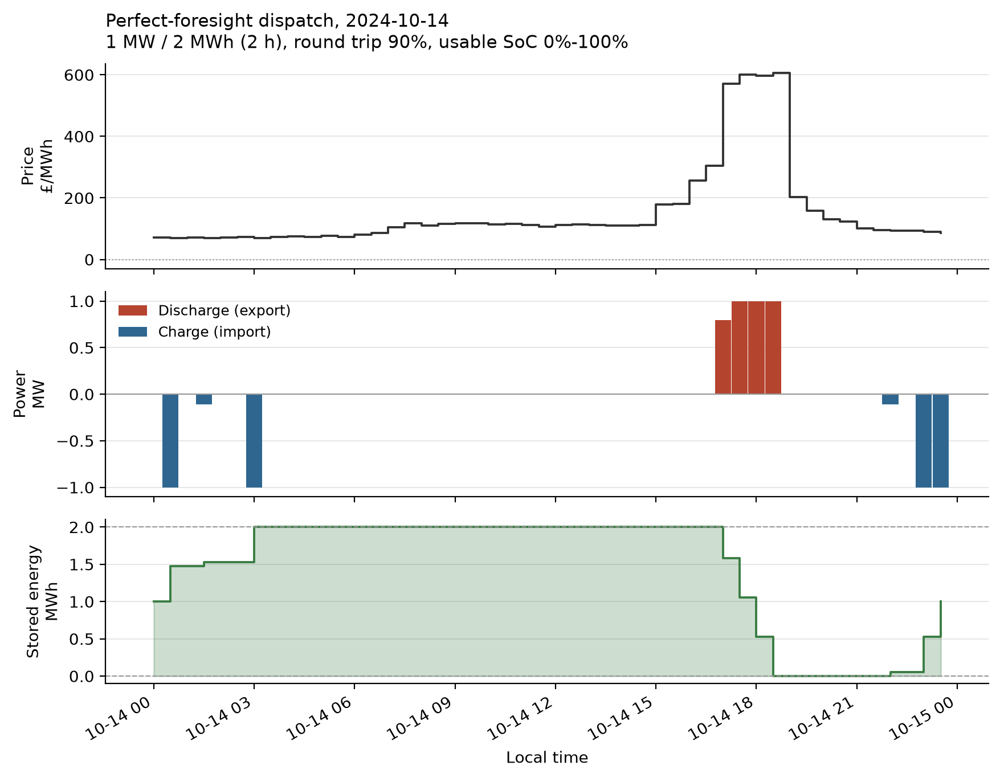

# GB Grid-Scale Battery Arbitrage Optimiser

Built a dispatch optimiser for a modelled **1 MW / 2 MWh grid-scale battery** using two years
of half-hourly **Elexon Market Index Data (2023-2024)**. The project formulates dispatch as a
mixed-integer linear programme (MILP) that maximises wholesale electricity arbitrage revenue
subject to state-of-charge, power and round-trip efficiency constraints, then validates every
solved schedule against an independent replay engine that shares no code with the solver.

Supporting it is a full data pipeline: GB settlement-period handling across clock changes,
detection of liquidity-defaulted prices against the BSC rulebook, daily optimisation with the
HiGHS solver, and a 49-test suite covering constraints and analytically checkable cases.

## Key result

**£50,248 to £50,456 per MW per year**, the perfect-foresight wholesale arbitrage benchmark for
a GB battery at **90% round-trip efficiency** across **728 daily MILP solves**. The range
reflects two treatments of three excluded settlement days, worth 0.41% of annual revenue.

This is an upper bound, not an expected return. Capturing it requires 872 equivalent full
cycles a year, roughly twice what a real asset sustains. Adding a degradation cost of
**£10/MWh of throughput** reduces cycling by **31.8%** for a revenue reduction of **4.9%**,
which is the trade-off between battery lifetime and arbitrage profit made explicit.

## What I built

- **Elexon Insights API client**: half-hourly Market Index Data, 7-day request windows,
  cached to Parquet so re-runs cost no API calls
- **Cleaning and quality pipeline**: UTC grid reindexing, clock-change handling,
  gap interpolation with flags, frozen-feed detection, liquidity-default classification,
  day-level usability gating
- **MILP dispatch optimiser**: PuLP with HiGHS, solved per settlement day
- **Independent replay**: recomputes revenue and state of charge in pandas, sharing no code
  with the solver, asserted against the objective to 1e-6
- **Threshold baseline**: a trailing-percentile rule the optimiser must beat
- **Degradation sweep and sensitivity analysis**: 24 full-period runs across degradation cost,
  duration and round-trip efficiency
- **49 tests** covering the calendar, cleaner, battery constraints and degenerate cases

## Results

### Benchmark

| Period | Revenue | Equivalent full cycles |
|---|---|---|
| 2023 | £58,689/MW/yr | 912.2 |
| 2024 | £42,312/MW/yr | 832.2 |
| Two-year average | £50,456/MW/yr | 871.9 |

Each figure is annualised, meaning revenue divided by the fraction of a year actually solved,
not a raw sum. The distinction matters: summing the two annual rates does not give the two-year
rate, and an earlier version of this table conflated the two.

728 of 731 settlement days solved. The fall from 2023 to 2024 is the decay of post-crisis
price volatility. Results from a two-year window are period-dependent, and this shows by how
much.

Daily net revenue: mean £138.14, median £114.98, p90 £237.81, best £962.21 (14 October 2024),
no loss-making days. Zero loss-making days is expected rather than impressive: with hindsight
the optimiser can always decline to trade.

### Degradation



| Degradation cost | Gross revenue | Cycles/yr | Revenue retained | Cycles retained |
|---|---|---|---|---|
| £0/MWh | £50,456 | 871.9 | 100% | 100% |
| £5/MWh | £49,711 | 711.3 | 98.5% | 81.6% |
| £10/MWh | £47,999 | 594.9 | 95.1% | 68.2% |
| £20/MWh | £42,755 | 415.8 | 84.7% | 47.7% |
| £50/MWh | £25,621 | 150.5 | 50.8% | 17.3% |

Nearly flat below £10/MWh, steep above £20/MWh. The knee sits in the £10 to £20 band.

Revenues are gross. The degradation charge is a shadow price steering the optimiser, not a
cash cost paid to anyone.

### Duration and efficiency



Revenue per MW of connection, £/year:

| | 80% | 85% | 90% | 92% |
|---|---|---|---|---|
| **1 h** | 22,251 | 26,249 | 30,941 | 33,136 |
| **2 h** | 36,368 | 42,961 | 50,456 | 53,786 |
| **4 h** | 53,335 | 62,937 | 73,823 | 78,579 |

Per MWh of installed energy, £/year:

| | 80% | 85% | 90% | 92% |
|---|---|---|---|---|
| **1 h** | 22,251 | 26,249 | 30,941 | 33,136 |
| **2 h** | 18,184 | 21,481 | 25,228 | 26,893 |
| **4 h** | 13,334 | 15,734 | 18,456 | 19,645 |

The 1 h row is identical in both tables by construction, since a 1 h system has exactly one
MWh of storage per MW of connection. It is not a copy-paste error.

Duration buys revenue sub-linearly, at 1.63x from 1 h to 2 h and 1.46x from 2 h to 4 h, and
value per MWh of cells falls monotonically.

The 2 h / 90% cell reads £50,456, identical to the benchmark run. The two figures come from
different code paths, a parameter sweep and a direct solve, so their agreement is a check that
the sweep is rebuilding the problem the same way.

### Baseline

A trailing-percentile rule (charge below the 25th percentile of the previous 7 days,
discharge above the 75th) captures **36.4%** of the optimiser's revenue.

| | MILP | Threshold rule |
|---|---|---|
| Revenue | £50,310/MW/yr | £18,332/MW/yr |
| Cycles/yr | 872.0 | 288.4 |
| Loss-making days | 0 | 115 of 727 |

The MILP figure here is £50,310 rather than £50,456 because the comparison is restricted to
the 727 days on which both strategies ran. Two independent exclusions produce that count: the
benchmark drops three days for data quality, and the threshold rule needs a prior day to
compute its trailing percentiles, so it cannot trade the first day of the sample. Verified by
`scripts/check_benchmark_coverage.py`, which reports the days present in each run and absent
from the other in both directions.

The rule trades less and still captures far less, so it is losing on period selection rather
than on volume. It is a strategy baseline, not a foresight baseline: it sees only trailing
data while the optimiser sees the whole day, so the 36.4% mixes a worse decision rule with
worse information.

### A representative day



14 October 2024, the highest-spread day in the sample at £536/MWh naive high-to-low, earning
£962.21 across 0.95 equivalent full cycles.

## Model

1 MW / 2 MWh, 90% round-trip efficiency, no auxiliary load, perfect availability. Power is
measured at the grid connection point, so revenue carries no efficiency term and the
round-trip loss enters only through the energy balance. Charge and discharge are separate
non-negative variables with a binary preventing simultaneous operation. Each settlement day is
solved independently with closing state of charge matched to the opening 50%.

Full formulation, the reasoning behind each choice, and what the alternatives would have cost:
[`docs/model.md`](docs/model.md).

## Validation

Every optimisation schedule is independently replayed in pandas and matched against the MILP
objective to **1e-6**. The replay shares no code with the solver, so an error common to both
cannot cancel out and pass.

- Constraint tests: SoC bounds, power limits, no simultaneous charge/discharge, energy in
  times efficiency equals energy out over a closed cycle
- Degenerate cases checkable by hand: flat prices give exactly zero revenue; a spread
  insufficient to compensate for round-trip losses is declined; a single spike is sold into at
  full power with charging in the cheapest periods
- The linear relaxation is asserted to bound the integer optimum
- The optimiser beats the threshold baseline on 99.7% of days
- The parameter sweep and the direct benchmark solve agree to the pound on the shared cell

```powershell
python -m pytest tests/ -q     # 49 passed
```

### What validation caught

Classifying zero prices by traded volume rather than by their shape identified 15
liquidity-defaulted periods that the earlier rule had passed through as real prices, alongside
2 genuine £0.00 market clears that correctly survive cleaning. Correcting them moved the
headline from £50,671 to £50,456, a fall of 0.42%, entirely in one direction.

That direction is the point. A perfect-foresight optimiser selects each day's price extremes,
so a spurious £0.00 is close to certain to be chosen as a charging period, and the resulting
error is one-sided rather than noisy. The largest single contributor, 2023-01-28, had earned
£460.33 and ranked **7th of 729 days**, inside the top 1% of two years of trading, placed there
by seven prices that were never traded at.

## Data

The benchmark uses **Elexon Insights Market Index Data (APX provider)** from **1 January 2023
to 31 December 2024**, covering **35,088 half-hour settlement periods** across **731 settlement
days**.

The preprocessing pipeline:

- reindexes prices onto a complete UTC settlement calendar
- handles daylight-saving transitions, including 46-period and 50-period settlement days
- detects liquidity-defaulted prices using traded volume
- interpolates short gaps with audit flags
- gates unusable settlement days before optimisation

The full cleaning policy, provider-selection rationale and Market Index Data discussion are
documented in [`docs/model.md`](docs/model.md).

## Reproducing

```powershell
python -m venv .venv
.venv\Scripts\Activate.ps1
pip install -r requirements.lock.txt

# Two years of prices, one month per request. Cached, so re-runs cost no API calls.
$d = Get-Date "2023-01-01"
while ($d -le (Get-Date "2024-12-01")) {
    python -m scripts.fetch_prices --start $d.ToString("yyyy-MM-dd") `
        --end $d.AddMonths(1).AddDays(-1).ToString("yyyy-MM-dd")
    $d = $d.AddMonths(1)
}

python -m scripts.build_dataset              # concatenate, clean, quality report
python -m scripts.audit_liquidity_defaults   # defaulted vs traded zeros, days affected
python -m scripts.run_benchmark              # perfect-foresight benchmark
python -m scripts.run_baseline               # threshold comparison
python -m scripts.check_benchmark_coverage   # reconcile benchmark and baseline day sets
python -m scripts.run_degradation_sweep      # frontier + figure
python -m scripts.run_sensitivity            # duration x efficiency + figure
python -m scripts.solve_day --file data/processed/prices_full.parquet --date 2024-10-14
```

Each full-period run takes about 15 seconds.

## Repository

```
src/fetch/elexon.py       Elexon API client, 7-day windows, Parquet cache
src/prep/calendar_gb.py   settlement-period calendar, 46/48/50-period days
src/prep/clean.py         cleaning policy, liquidity-default rule, quality reporting
src/model/battery.py      physical specification and independent simulator
src/model/milp.py         MILP formulation and solve
src/model/baselines.py    trailing-percentile threshold rule
scripts/                  command-line entry points
tests/                    49 tests
docs/model.md             formulation, design decisions, cleaning policy
```

Time is indexed in UTC throughout. Settlement date and period are carried as columns, since
they are the join key for Elexon and NESO data. Local time is derived for calendar features
and plot axes only, never used as an index: 01:00 on 27 October 2024 occurs twice.

## Open problems

Unresolved, and stated here because they bear on whether the headline is right.

**No external benchmark comparison yet.** The obvious sanity check is against published GB
fleet revenues, and it has not been done. It needs care: published figures cover the full
revenue stack (wholesale, frequency response, Balancing Mechanism, Capacity Market) earned
with imperfect forecasts, where this model covers wholesale alone with perfect hindsight. The
comparison also has to match on duration, since this model's own sensitivity shows duration
moves revenue 2.4x across the 1 to 4 h range and the GB fleet skews short.

**The annualisation imputes the sample mean for excluded days.** Revenue is divided by
`days_solved / 365.25`, which does not treat a skipped day as zero. It treats it as worth
whatever the surviving days averaged. That would be defensible if the days were missing at
random. They are not: they were excluded because their prices were liquidity-defaulted, and a
defaulted price means traded volume below the liquidity threshold, which may correlate with
thin, low-volatility, low-spread trading. If it does, the imputation flatters the result. The
stated range brackets the assumption rather than hiding it.

**The APX liquidity-default rate does not match the published figure.** This dataset has 21
absent or defaulted APX periods in 35,088, or 0.06%, and none at all in 2024. Elexon's own
MIDS review reports roughly 0.7% for EPEX SPOT over August 2024 to July 2025, a window this
sample overlaps by five months. An eleven-fold gap is not obviously explained by year-to-year
variation. One candidate: the Insights API may omit rows for periods with no qualifying trades
rather than returning a defaulted zero, so those periods never arrive to be counted. Testable
against a 2025 month, and not yet tested.

**Residual upward bias from the optimiser's curse.** The known contributors have been found and
removed, as described under Validation, but any remaining noise in the price series biases the
benchmark upward rather than symmetrically, for the same reason. The sign of whatever remains
is still positive.

## Limitations

- Price-taker: the battery does not move the price, false at fleet scale
- Traded at a volume-weighted prompt index rather than a day-ahead auction clearing price.
  Market Index Data excludes the day-ahead auction by rule, so this is a prompt reference price
  and not a price anyone can transact at
- Wholesale arbitrage only, with no frequency response, Balancing Mechanism or Capacity Market
- Perfect foresight only; no forecast-driven strategy yet
- Degradation is throughput-based, with no depth-of-discharge weighting, rainflow counting,
  calendar ageing or temperature coupling
- No network constraints, outages or derating; single asset, single connection point
- Two years of one volatility regime

## Next

Day-ahead price forecasting under strict information sets, rolling-horizon optimisation
against forecasts, settlement against outturn with imbalance exposure, and attribution of the
resulting foresight gap. The revenue-capture percentage this project is built to measure does
not exist yet.

## Development

Built with substantial use of an LLM as a pair programmer. The modelling decisions, validation
design and result interrogation are documented in `docs/model.md` and in the commit history.
