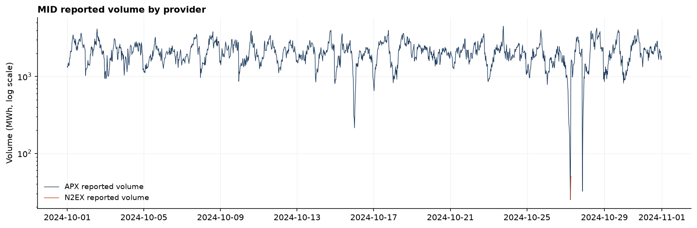

# Model formulation and design decisions

Reasoning behind each modelling choice, what the obvious alternative was, and what it would
have cost.

## Battery model

### Power measured at the grid connection point

Every power variable is what the meter sees, not what the cells see. Charging is import,
discharging is export.

The consequence is that the revenue expression contains no efficiency term at all: the asset
buys `charge × dt` MWh and sells `discharge × dt` MWh at the posted price. Round-trip
efficiency enters exclusively through the energy balance.

**Alternative:** measure at the cell terminals. This forces an efficiency factor into both the
energy balance and the cashflow. The most common error in these models is applying the loss
twice, and it is invisible in the output, because revenue is simply too low by a
plausible-looking margin. Choosing the meter side makes that error structurally impossible
rather than something to be careful about.

### Round-trip loss split symmetrically

One-way efficiencies are `√η` on each leg, so their product is the round trip.

Only the product is observable from meter data. The split is therefore a convention, not a
measurement. It matters because the two legs are applied at different prices: a 95%/95% split
and a 100%/90% split have identical round trips but move value between the buy and the sell.
Symmetric is the standard choice and the sensitivity analysis can perturb it.

### Separate charge and discharge variables

Charge and discharge are two non-negative variables rather than one signed variable.

**Alternative:** a single signed power variable is more compact. But the energy balance needs
`×η` when the variable is positive and `÷η` when negative, and that is a conditional.
Conditionals are not linear. Splitting into two variables is what makes the balance expressible
in a linear programme at all.

## MILP formulation

For periods `t = 1..T` of length `dt` hours with price `p_t`:

```
maximise   Σ p_t (d_t − c_t) dt  −  k Σ d_t dt

subject to  s_t = s_{t−1} + η_c c_t dt − d_t dt / η_d      energy balance
            s_min ≤ s_t ≤ s_max                            usable window
            0 ≤ c_t ≤ P u_t                                charge limit
            0 ≤ d_t ≤ P (1 − u_t)                          discharge limit
            s_0 = s_init,  s_T = s_term                    boundary
            u_t ∈ {0,1}
```

`c` and `d` are charge and discharge power at the meter, `s` is stored energy, `k` is the
degradation cost per MWh discharged, `P` is the power rating.

Charging loses energy on the way in, so less arrives than was imported, hence `× η_c`.
Discharging loses energy on the way out, so more must be drawn from storage than reaches the
meter, hence `÷ η_d`.

Note that efficiency is not a constraint. It is a coefficient inside the energy-balance
equality, and the only true constraints on the physics are the state-of-charge window, the
power limits and the mutual exclusion. Describing efficiency as a constraint would imply it
restricts a feasible region, when what it actually does is rescale the conversion between
metered power and stored energy.

Solved with PuLP and the HiGHS solver, one settlement day at a time.

### Why the binary variable is necessary

Without `u`, the linear programme can set charge and discharge equal in the same period. Net
meter flow is zero, so no cash changes hands, but the energy balance still loses
`x·dt·(1/η_d − η_c)` MWh. That is a free energy sink: a way to destroy stored energy at no
cost, which the physical asset does not offer.

It becomes valuable exactly when the optimiser wants to shed energy without selling it, most
obviously under negative prices with a terminal state-of-charge constraint to satisfy. The
sample contains hundreds of negative-price periods, so this is not hypothetical.

The linear relaxation is available via `solve_dispatch(..., relax_binaries=True)` and is
asserted in the test suite to be an upper bound on the integer optimum.

### Big-M is the power rating

In `c_t ≤ P·u_t`, the constant `P` is the big-M. It is the tightest valid bound.

A loose constant, say 10⁶, gives an identical integer feasible set but a much weaker linear
relaxation. Branch-and-bound then explores far more nodes, and on some solvers the constraint
becomes numerically degenerate. Deriving M from a physical bound rather than picking a large
number is the defence against both.

### Day-boundary state of charge

Closing state of charge is forced equal to the opening 50%.

**Alternatives and their costs:**

- *Leave it free.* The optimiser liquidates its inventory in the final period of every day
  regardless of price, a trade it could only make once, repeated 731 times. Inflates revenue.
- *Force it to zero.* Arbitrary, and wastes the option value of holding charge overnight.
- *Chain state of charge across the whole period.* Most realistic, but daily revenues are no
  longer additive, so the monthly breakdown becomes ill-defined and the single-day solve
  becomes a single 35,088-period solve.

Matching start to end makes each day self-contained and daily revenues additive. The cost is
genuine overnight arbitrage between a cheap night and the following evening peak, which this
formulation cannot capture. The headline is understated by that amount, currently unquantified.

### Degradation charged on discharge only

Charging the same energy on both legs would double the effective cost per cycle relative to
the £/MWh figures quoted in the literature. Degradation cost is a shadow price steering the
optimiser, not a cash expense, which is why the frontier reports gross revenue.

### Why the degradation curve has the shape it does

At zero wear cost the optimiser accepts every trade that improves the objective, including
spreads that barely compensate for the round-trip losses. Those marginal cycles carry
negligible revenue but full wear. Pricing wear removes them in order of profitability, so the
first cycles sacrificed are the least valuable ones, which is why 31.8% of cycling can be
given up for 4.9% of revenue.

The curve flattens near the origin because the distribution of daily spreads is heavily
right-skewed: a small number of volatile days carry most of the revenue. October 2024 shows
this directly, with a mean daily spread of £91.86 against a median of £76.61.

### How the annualisation treats excluded days

Annual revenue is computed as `net revenue / (days_solved / 365.25)`. That is not the same as
treating an excluded day as earning zero. It credits every excluded day with the mean of the
days that survived.

This is mean imputation arrived at through a division rather than chosen deliberately, and it
is only honest if the excluded days are missing at random. They are not. Days are excluded
because their prices were liquidity-defaulted, and a defaulted price means traded volume below
the Individual Liquidity Threshold, which may correlate with low volatility and therefore
below-average spread. If it does, the imputation flatters the result. That link is a hypothesis
rather than a finding: all 15 defaulted periods here carry volume of exactly zero, meaning no
qualifying trades at all rather than thin trading, and the two are not the same thing.

Removing 2023-01-28 makes the arithmetic visible. Its £460.33 leaves the numerator, costing
£285/MW/yr; the denominator then shrinks from 729 days to 728, handing £69 back. Net effect
is −£216. The £69 is the imputation, and it has no evidential basis.

The headline is therefore stated as a range. £50,456/MW/yr annualises over the 728 solved days;
£50,248/MW/yr values all three excluded days at zero. The width of 0.41% is the cost of the
exclusion, and quoting a single point would hide an assumption that cannot be tested.

## Data cleaning policy

Non-destructive. No row is dropped and no price is overwritten except by short-gap
interpolation, which is recorded in a flag column.

**Reindex onto a complete half-hourly UTC grid.** Missing periods become explicit NaN rows.
In UTC there are no ambiguous or nonexistent timestamps, so one `reindex` call exposes every
hole. Under a `(date, period)` index this would require constructing the expected period count
per day first, which means solving the clock-change problem anyway, for nothing gained.

**Duplicates dropped, keeping the first.** These arise from the Elexon API filtering
inclusively at both ends of a fetch window, so both copies are the same row from the same
source. If they came from a genuine restatement, the later one would be correct.

**Interpolate gaps of at most 2 periods, linearly, never extrapolating.** One hour is
defensible because half-hourly prices are strongly autocorrelated at that horizon. A longer
limit fabricates a smooth ramp with no spread, which the optimiser then trades against, with
a bias whose sign depends on where the hole falls.

*This is look-ahead.* Interpolation uses both neighbours, so a filled value at time `t` depends
on the price at `t+1`. Acceptable for a hindsight benchmark; not acceptable inside a
forecast-driven path, where filled values must be constructed from past observations only.
Flagging every filled value is what makes that split enforceable later.

**Plausibility band of −£1,000 to £6,000/MWh** flags suspected feed corruption. Prices are
**not** winsorised. The tails are the revenue: a battery earns from the spread, and a
percentile clip deletes exactly the observations that carry it.

**Frozen-feed detection** flags runs of six or more identical prices. A stuck feed and a flat
market look identical in a price column, and only one of them is a data fault. This matters
because a flat run destroys spread, the opposite failure mode to a spurious spike, and it
depresses rather than inflates the benchmark. Both directions are bias.

**Day-level gating.** The optimiser consumes whole days with a state-of-charge boundary
condition, so a day with a hole cannot be optimised honestly. The optimiser routes around the
missing period and reports revenue that assumes the market did not exist for half an hour.
Days are flagged, not deleted: the rows stay for lagged features, and a report that says "these
days were excluded, here they are" is defensible where a silently shorter dataset is not.

### Liquidity-defaulted prices

**Zeros are classified by the volume beside them, not by their shape.**

The Market Index Definition Statement sets an Individual Liquidity Threshold of 25 MWh, applied
identically to both Market Index Data Providers. Where qualifying traded volume in a settlement
period falls below it, the provider defaults *both* the Market Index Price and the Market Index
Volume to zero. A defaulted price records an absence of liquidity, not a traded price of zero.

The original rule here was a run-length test: zeros appearing in long runs were treated as
missing, isolated zeros were kept. That was a reasonable inference from the shape of the N2EX
series and it was right about N2EX, but it cannot classify an isolated zero at all. One
defaulted period surrounded by ordinary prices is indistinguishable from one genuine one. That
is the dangerous case, because a perfect-foresight optimiser sorts each day and selects the
extremes, so a spurious price of zero is close to certain to be chosen as a charging period,
and the resulting error is one-directional rather than merely noisy.

The two cases separate cleanly on volume:

| | price = 0 | price ≠ 0 |
|---|---|---|
| volume ≥ 25 MWh | traded at zero, keep | ordinary period |
| volume < 25 MWh | defaulted, treat as missing | cannot occur under the rule |

The forbidden combination is counted rather than ignored. A non-zero count would mean the
volume field does not mean what it is assumed to mean, or that the threshold in force over the
sample differs from the configured one. In either case the test is unsafe and the count has to
be explained before its output is trusted. Across 35,088 periods the count is zero, which is
what licenses the rest.

**The correct test is `volume < threshold`, not `volume == 0`.** They disagree in exactly one
circumstance: a period where qualifying trades existed but totalled under 25 MWh. There the
provider still defaults the price, but reports the genuine sub-threshold volume rather than
zero, so an equality test would let a defaulted price through. In this sample the two tests
agree on all 15 cases, every one carrying volume of exactly zero, meaning no qualifying trades
at all rather than thin trading.

**The threshold is a MIDS parameter, not a constant.** It is reviewed annually by the Imbalance
Settlement Group, so it is exposed as `CleaningPolicy.liquidity_threshold_mwh` and a historical
sample can be cleaned against the threshold actually in force.

**What it found.** 17 APX periods report exactly £0.00. Fifteen are defaulted; two are genuine
market clears carrying full volume, and they survive cleaning. A blanket "drop the zeros" rule
would have destroyed two real observations. The 15 fall across five settlement days: three
(2023-01-28, 2023-08-23, 2023-08-24) carry enough to gate the day out entirely, and two
(2023-03-14, 2023-09-27) had a single period each and were repaired by interpolation.
2023-08-23 and 2023-08-24 share one run of six defaulted periods straddling midnight, which
explains why two consecutive days had previously failed together as a "frozen feed". The old
detector found the right periods for the wrong reason.

Defaulted periods become NaN and are then handled by the existing gap policy, so the
interpolation applied to an isolated one is two-sided and therefore look-ahead. Acceptable in a
hindsight benchmark; must be replaced by a backward-only fill inside the forecast-driven path.

## What Market Index Data is

MID is not the day-ahead auction price, and this project does not treat it as one.

Each Market Index Data Provider reports a half-hourly price and volume derived from trades in
its own short-term market. The products included are the Half Hour, One Hour, Two Hour and Four
Hour contracts traded within eight hours of the submission deadline; the Day Ahead Auction
product carries a weighting of zero in every timeband and is excluded by rule. Roughly 91% of
the included volume is traded within four hours of the settlement period.

Three consequences, all of which belong in the limitations rather than a footnote:

- **The series is a prompt index, not an auction clear.** A battery optimised against it is
  assumed to transact at the volume-weighted average of other participants' short-term trades.
  That is a stronger price-taker assumption than transacting at an auction clearing price,
  because an index is not a price anyone can hit.
- **Block products flatten the shape.** Two-hour and four-hour trades are folded into every
  half hour they span, so the half-hourly profile is smoothed relative to true half-hourly
  prompt prices. The MIDS acknowledges this directly: one of its stated weighting principles is
  to minimise the flattening effect of products priced over periods longer than a settlement
  period.
- **MID is not fully independent of the imbalance price.** Since P305 the Market Index Price
  sets the System Price in two cases: when Net Imbalance Volume is zero, and when every action
  in the price stack is unpriced, in which case the MIP sets the Replacement Price. The second
  case is not rare. Settling a forecast-driven position against cash-out while trading at MID
  therefore has a subset of periods in which the traded price and the settlement price are the
  same number by construction, and imbalance cost in those periods is identically zero. That is
  an artefact of the data choice and must be reported as one.

## Provider selection

The volume-weighted market index price was rejected in favour of APX alone.

The original rationale for the blend was that it makes the market assumption explicit rather
than pretending the battery trades on one exchange. The data contradicted it:

| | APX | N2EX |
|---|---|---|
| Volume share, Oct 2024 | 99.99% | 0.01% |
| Distinct values in 1,490 periods | 1,355 | 7 |
| Longest constant run | 2 | 715 |
| Periods reporting exactly £0.00 | 0 | 1,484 |
| Defaulted periods, full two years | 15 of 35,088 (0.04%) | 34,934 of 35,088 (99.56%) |

Correlation between the two series is −0.02, and the mean difference is −£81.93, which is
approximately the negated APX mean, the signature of one series being near-constant at zero.



The full-period default rate is the strongest evidence, and it was reached independently of the
rulebook. Elexon's own MIDS review reports Nord Pool defaulting roughly 99.3% of settlement
periods over its review year; this sample gives 99.56% over a different two-year window. A
diagnosis made from the shape of the data and a published regulatory statistic agree to within
a quarter of a percentage point.

A weighted average of one real input is that input. The blend was not harmless: because N2EX
carried a small non-zero weight, it shifted individual settlement prices by up to £7.73/MWh.

**What would have changed the decision:** a plausible distinct-value count, correlation near 1,
and a mean difference near zero. All three failed.

**One thing that does not fit.** The APX default rate here is 0.04%, or 0.06% counting the six
absent periods, and there are none at all in 2024. Elexon reports roughly 0.7% for EPEX SPOT
over August 2024 to July 2025, a window this sample overlaps by five months. An eleven-fold gap
is not obviously explained by year-to-year variation. One candidate is that the Insights API
omits rows entirely for periods with no qualifying trades rather than returning a defaulted
zero, so they never arrive to be counted. Testable against a 2025 month, not yet tested, and
recorded here rather than smoothed over.

## Time indexing

The canonical index is a timezone-aware UTC `DatetimeIndex`. Settlement date and period are
carried as columns, since they are the join key for Elexon and NESO data and the audit trail.
Local time is derived for calendar features and plot axes only, never used as an index.

Local time is unusable as an index because 01:00 on 27 October 2024 occurs twice, at settlement
periods 3 and 5.

### Two bugs this indexing decision produced

**`pd.Timedelta(days=1)` on a tz-aware timestamp advances 24 absolute hours, not one calendar
day.** On a clock-change day it lands on 23:00 or 01:00 local, not midnight, and a single-day
grid for 27 October returns 48 periods instead of 50. Fix: increment the naive date, then
localise. Timedelta is physics; calendar arithmetic is calendar; they diverge twice a year.

**An out-of-range settlement period does not produce an invalid timestamp.** SP50 on a normal
48-period day maps to a valid half-hour belonging to the next settlement day, colliding with
its SP2 and silently growing the frame by one row. Fix: validate `(date, period)` labels before
converting to timestamps, which is to say validate where the error is still visible as itself.

## Validation design

**The replay shares no code with the solver.** `simulate_schedule` reconstructs state of charge
and revenue from the dispatch schedule alone. If it shared code with the optimiser, an error
common to both would cancel out and pass. Agreement between two independent implementations is
evidence; agreement between one implementation and itself is not.

**Degenerate cases are checkable by hand.** With flat prices, revenue must be exactly zero,
with and without losses. A spread insufficient to compensate for the round-trip losses must be
declined. A single spike must be sold into at full power with charging placed in the cheapest
available periods. These are the tests that catch a sign error or a doubled efficiency, which
the constraint tests cannot see.

**Two derivations of the same quantity must agree.** The duration-efficiency sweep and the
direct benchmark solve share one cell, 2 h at 90%, and both return £50,456/MW/yr. They run
through different code paths, so agreement is a check that the sweep rebuilds the problem
identically. The same principle caught a reporting error in the annual breakdown: the 2023 and
2024 figures summed exactly to the two-year total, which is impossible for annualised rates and
revealed that raw sums had been labelled as rates.

**The optimiser's curse.** A perfect-foresight optimiser sorts each day's prices and selects the
extremes, so it preferentially picks periods whose noise runs in its favour. Zero-mean input
noise therefore produces a strictly positive bias in output revenue, and it does not average
away with more data, because each day contributes its own positive bias. The consequence is
that sloppy data cleaning inflates the benchmark and therefore deflates any "% of perfect
foresight captured" figure measured against it.

This was demonstrated rather than asserted. Before the liquidity rule was applied, 2023-01-28
earned £460.33 and ranked 7th of 729 days, inside the top 1% of two years of trading. It was
there because the optimiser had found seven spurious £0.00 prices to charge against. Correcting
15 such periods across the whole sample moved the headline by 0.42%, every penny of it
downward. Fifteen bad observations in 35,088 produced a one-directional error, which is exactly
the behaviour the curse predicts and not the behaviour random noise would produce.

## Baseline comparison

The threshold rule charges below the 25th percentile and discharges above the 75th, with
thresholds computed from a trailing 7-day window that excludes the current day. Excluding the
current day matters: including it would let the rule see prices it could not have known when
the first decision of the day was taken, which is the look-ahead the perfect-foresight
benchmark admits openly and a baseline must not.

The rule does not return to its opening state of charge, so residual inventory is marked to
market at the day's mean price. Valuing it at the closing price instead would let the rule bank
an unrealised gain it never traded; the mean is the neutral choice.

The two runs cover different day sets for two independent reasons: the benchmark excludes
three days for data quality, and the rule cannot trade the first day of the sample because it
has no trailing window. `scripts/check_benchmark_coverage.py` reconciles them explicitly,
printing the days present in one and absent from the other in both directions, and restates
both revenues over the 727 shared days. Asserting the reason for a day-count gap without
checking it is how a plausible explanation survives into a README unverified.