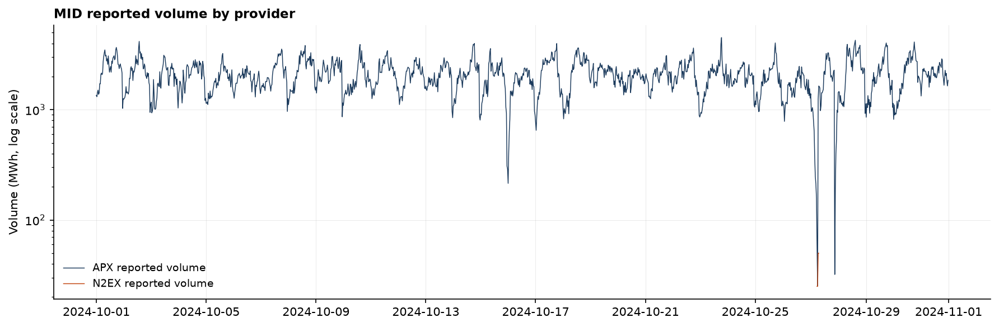

# Model formulation and design decisions

Reasoning behind each modelling choice, what the obvious alternative was, and what it would
have cost.

## Battery model

### Power measured at the grid connection point

Every power variable is what the meter sees, not what the cells see. Charging is import,
discharging is export.

The consequence is that the revenue expression contains no efficiency term at all: the asset
buys `charge × dt` MWh and sells `discharge × dt` MWh at the posted price. Round-trip
efficiency enters exclusively through the energy balance.

**Alternative:** measure at the cell terminals. This forces an efficiency factor into both the
energy balance and the cashflow. The most common error in these models is applying the loss
twice, and it is invisible in the output, because revenue is simply too low by a
plausible-looking margin. Choosing the meter side makes that error structurally impossible
rather than something to be careful about.

### Round-trip loss split symmetrically

One-way efficiencies are `√η` on each leg, so their product is the round trip.

Only the product is observable from meter data. The split is therefore a convention, not a
measurement. It matters because the two legs are applied at different prices: a 95%/95% split
and a 100%/90% split have identical round trips but move value between the buy and the sell.
Symmetric is the standard choice and the sensitivity analysis can perturb it.

### Separate charge and discharge variables

Charge and discharge are two non-negative variables rather than one signed variable.

**Alternative:** a single signed power variable is more compact. But the energy balance needs
`×η` when the variable is positive and `÷η` when negative, and that is a conditional.
Conditionals are not linear. Splitting into two variables is what makes the balance expressible
in a linear programme at all.

## MILP formulation

For periods `t = 1..T` of length `dt` hours with price `p_t`:

```
maximise   Σ p_t (d_t − c_t) dt  −  k Σ d_t dt

subject to  s_t = s_{t−1} + η_c c_t dt − d_t dt / η_d      energy balance
            s_min ≤ s_t ≤ s_max                            usable window
            0 ≤ c_t ≤ P u_t                                charge limit
            0 ≤ d_t ≤ P (1 − u_t)                          discharge limit
            s_0 = s_init,  s_T = s_term                    boundary
            u_t ∈ {0,1}
```

`c` and `d` are charge and discharge power at the meter, `s` is stored energy, `k` is the
degradation cost per MWh discharged, `P` is the power rating.

Charging loses energy on the way in, so less arrives than was imported, hence `× η_c`.
Discharging loses energy on the way out, so more must be drawn from storage than reaches the
meter, hence `÷ η_d`.

Note that efficiency is not a constraint. It is a coefficient inside the energy-balance
equality, and the only true constraints on the physics are the state-of-charge window, the
power limits and the mutual exclusion. Describing efficiency as a constraint would imply it
restricts a feasible region, when what it actually does is rescale the conversion between
metered power and stored energy.

Solved with PuLP and the HiGHS solver, one settlement day at a time.

### Why the binary variable is necessary

Without `u`, the linear programme can set charge and discharge equal in the same period. Net
meter flow is zero, so no cash changes hands, but the energy balance still loses
`x·dt·(1/η_d − η_c)` MWh. That is a free energy sink: a way to destroy stored energy at no
cost, which the physical asset does not offer.

It becomes valuable exactly when the optimiser wants to shed energy without selling it, most
obviously under negative prices with a terminal state-of-charge constraint to satisfy. The
sample contains hundreds of negative-price periods, so this is not hypothetical.

The linear relaxation is available via `solve_dispatch(..., relax_binaries=True)` and is
asserted in the test suite to be an upper bound on the integer optimum.

### Big-M is the power rating

In `c_t ≤ P·u_t`, the constant `P` is the big-M. It is the tightest valid bound.

A loose constant, say 10⁶, gives an identical integer feasible set but a much weaker linear
relaxation. Branch-and-bound then explores far more nodes, and on some solvers the constraint
becomes numerically degenerate. Deriving M from a physical bound rather than picking a large
number is the defence against both.

### Day-boundary state of charge

Closing state of charge is forced equal to the opening 50%.

**Alternatives and their costs:**

- *Leave it free.* The optimiser liquidates its inventory in the final period of every day
  regardless of price, a trade it could only make once, repeated 731 times. Inflates revenue.
- *Force it to zero.* Arbitrary, and wastes the option value of holding charge overnight.
- *Chain state of charge across the whole period.* Most realistic, but daily revenues are no
  longer additive, so the monthly breakdown becomes ill-defined and the single-day solve
  becomes a single 35,088-period solve.

Matching start to end makes each day self-contained and daily revenues additive. The cost is
genuine overnight arbitrage between a cheap night and the following evening peak, which this
formulation cannot capture. The headline is understated by that amount, currently unquantified.

### Degradation charged on discharge only

Charging the same energy on both legs would double the effective cost per cycle relative to
the £/MWh figures quoted in the literature. Degradation cost is a shadow price steering the
optimiser, not a cash expense, which is why the frontier reports gross revenue.

### Why the degradation curve has the shape it does

At zero wear cost the optimiser accepts every trade that improves the objective, including
spreads that barely compensate for the round-trip losses. Those marginal cycles carry
negligible revenue but full wear. Pricing wear removes them in order of profitability, so the
first cycles sacrificed are the least valuable ones, which is why 31.8% of cycling can be
given up for 4.9% of revenue.

The curve flattens near the origin because the distribution of daily spreads is heavily
right-skewed: a small number of volatile days carry most of the revenue. October 2024 shows
this directly, with a mean daily spread of £91.86 against a median of £76.61.

### How the annualisation treats excluded days

Annual revenue is computed as `net revenue / (days_solved / 365.25)`. That is not the same as
treating an excluded day as earning zero. It credits every excluded day with the mean of the
days that survived.

This is mean imputation arrived at through a division rather than chosen deliberately, and it
is only honest if the excluded days are missing at random. They are not. Days are excluded
because their prices were liquidity-defaulted, and a defaulted price means traded volume below
the Individual Liquidity Threshold, which may correlate with low volatility and therefore
below-average spread. If it does, the imputation flatters the result. That link is a hypothesis
rather than a finding: all 15 defaulted periods here carry volume of exactly zero, meaning no
qualifying trades at all rather than thin trading, and the two are not the same thing.

Removing 2023-01-28 makes the arithmetic visible. Its £460.33 leaves the numerator, costing
£285/MW/yr; the denominator then shrinks from 729 days to 728, handing £69 back. Net effect
is −£216. The £69 is the imputation, and it has no evidential basis.

The headline is therefore stated as a range. £50,456/MW/yr annualises over the 728 solved days;
£50,248/MW/yr values all three excluded days at zero. The width of 0.41% is the cost of the
exclusion, and quoting a single point would hide an assumption that cannot be tested.

## Data cleaning policy

Non-destructive. No row is dropped and no price is overwritten except by short-gap
interpolation, which is recorded in a flag column.

**Reindex onto a complete half-hourly UTC grid.** Missing periods become explicit NaN rows.
In UTC there are no ambiguous or nonexistent timestamps, so one `reindex` call exposes every
hole. Under a `(date, period)` index this would require constructing the expected period count
per day first, which means solving the clock-change problem anyway, for nothing gained.

**Duplicates dropped, keeping the first.** These arise from the Elexon API filtering
inclusively at both ends of a fetch window, so both copies are the same row from the same
source. If they came from a genuine restatement, the later one would be correct.

**Interpolate gaps of at most 2 periods, linearly, never extrapolating.** One hour is
defensible because half-hourly prices are strongly autocorrelated at that horizon. A longer
limit fabricates a smooth ramp with no spread, which the optimiser then trades against, with
a bias whose sign depends on where the hole falls.

*This is look-ahead.* Interpolation uses both neighbours, so a filled value at time `t` depends
on the price at `t+1`. Acceptable for a hindsight benchmark; not acceptable inside a
forecast-driven path, where filled values must be constructed from past observations only.
Flagging every filled value is what makes that split enforceable later.

**Plausibility band of −£1,000 to £6,000/MWh** flags suspected feed corruption. Prices are
**not** winsorised. The tails are the revenue: a battery earns from the spread, and a
percentile clip deletes exactly the observations that carry it.

**Frozen-feed detection** flags runs of six or more identical prices. A stuck feed and a flat
market look identical in a price column, and only one of them is a data fault. This matters
because a flat run destroys spread, the opposite failure mode to a spurious spike, and it
depresses rather than inflates the benchmark. Both directions are bias.

**Day-level gating.** The optimiser consumes whole days with a state-of-charge boundary
condition, so a day with a hole cannot be optimised honestly. The optimiser routes around the
missing period and reports revenue that assumes the market did not exist for half an hour.
Days are flagged, not deleted: the rows stay for lagged features, and a report that says "these
days were excluded, here they are" is defensible where a silently shorter dataset is not.

### Liquidity-defaulted prices

**Zeros are classified by the volume beside them, not by their shape.**

The Market Index Definition Statement sets an Individual Liquidity Threshold of 25 MWh, applied
identically to both Market Index Data Providers. Where qualifying traded volume in a settlement
period falls below it, the provider defaults *both* the Market Index Price and the Market Index
Volume to zero. A defaulted price records an absence of liquidity, not a traded price of zero.

The original rule here was a run-length test: zeros appearing in long runs were treated as
missing, isolated zeros were kept. That was a reasonable inference from the shape of the N2EX
series and it was right about N2EX, but it cannot classify an isolated zero at all. One
defaulted period surrounded by ordinary prices is indistinguishable from one genuine one. That
is the dangerous case, because a perfect-foresight optimiser sorts each day and selects the
extremes, so a spurious price of zero is close to certain to be chosen as a charging period,
and the resulting error is one-directional rather than merely noisy.

The two cases separate cleanly on volume:

| | price = 0 | price ≠ 0 |
|---|---|---|
| volume ≥ 25 MWh | traded at zero, keep | ordinary period |
| volume < 25 MWh | defaulted, treat as missing | cannot occur under the rule |

The forbidden combination is counted rather than ignored. A non-zero count would mean the
volume field does not mean what it is assumed to mean, or that the threshold in force over the
sample differs from the configured one. In either case the test is unsafe and the count has to
be explained before its output is trusted. Across 35,088 periods the count is zero, which is
what licenses the rest.

**The correct test is `volume < threshold`, not `volume == 0`.** They disagree in exactly one
circumstance: a period where qualifying trades existed but totalled under 25 MWh. There the
provider still defaults the price, but reports the genuine sub-threshold volume rather than
zero, so an equality test would let a defaulted price through. In this sample the two tests
agree on all 15 cases, every one carrying volume of exactly zero, meaning no qualifying trades
at all rather than thin trading.

**The threshold is a MIDS parameter, not a constant.** It is reviewed annually by the Imbalance
Settlement Group, so it is exposed as `CleaningPolicy.liquidity_threshold_mwh` and a historical
sample can be cleaned against the threshold actually in force.

**What it found.** 17 APX periods report exactly £0.00. Fifteen are defaulted; two are genuine
market clears carrying full volume, and they survive cleaning. A blanket "drop the zeros" rule
would have destroyed two real observations. The 15 fall across five settlement days: three
(2023-01-28, 2023-08-23, 2023-08-24) carry enough to gate the day out entirely, and two
(2023-03-14, 2023-09-27) had a single period each and were repaired by interpolation.
2023-08-23 and 2023-08-24 share one run of six defaulted periods straddling midnight, which
explains why two consecutive days had previously failed together as a "frozen feed". The old
detector found the right periods for the wrong reason.

Defaulted periods become NaN and are then handled by the existing gap policy, so the
interpolation applied to an isolated one is two-sided and therefore look-ahead. Acceptable in a
hindsight benchmark; must be replaced by a backward-only fill inside the forecast-driven path.

## What Market Index Data is

MID is not the day-ahead auction price, and this project does not treat it as one.

Each Market Index Data Provider reports a half-hourly price and volume derived from trades in
its own short-term market. The products included are the Half Hour, One Hour, Two Hour and Four
Hour contracts traded within eight hours of the submission deadline; the Day Ahead Auction
product carries a weighting of zero in every timeband and is excluded by rule. Roughly 91% of
the included volume is traded within four hours of the settlement period.

Three consequences, all of which belong in the limitations rather than a footnote:

- **The series is a prompt index, not an auction clear.** A battery optimised against it is
  assumed to transact at the volume-weighted average of other participants' short-term trades.
  That is a stronger price-taker assumption than transacting at an auction clearing price,
  because an index is not a price anyone can hit.
- **Block products flatten the shape.** Two-hour and four-hour trades are folded into every
  half hour they span, so the half-hourly profile is smoothed relative to true half-hourly
  prompt prices. The MIDS acknowledges this directly: one of its stated weighting principles is
  to minimise the flattening effect of products priced over periods longer than a settlement
  period.
- **MID is not fully independent of the imbalance price.** Since P305 the Market Index Price
  sets the System Price in two cases: when Net Imbalance Volume is zero, and when every action
  in the price stack is unpriced, in which case the MIP sets the Replacement Price. The second
  case is not rare. Settling a forecast-driven position against cash-out while trading at MID
  therefore has a subset of periods in which the traded price and the settlement price are the
  same number by construction, and imbalance cost in those periods is identically zero. That is
  an artefact of the data choice and must be reported as one.

## Provider selection

The volume-weighted market index price was rejected in favour of APX alone.

The original rationale for the blend was that it makes the market assumption explicit rather
than pretending the battery trades on one exchange. The data contradicted it:

| | APX | N2EX |
|---|---|---|
| Volume share, Oct 2024 | 99.99% | 0.01% |
| Distinct values in 1,490 periods | 1,355 | 7 |
| Longest constant run | 2 | 715 |
| Periods reporting exactly £0.00 | 0 | 1,484 |
| Defaulted periods, full two years | 15 of 35,088 (0.04%) | 34,934 of 35,088 (99.56%) |

Correlation between the two series is −0.02, and the mean difference is −£81.93, which is
approximately the negated APX mean, the signature of one series being near-constant at zero.



The full-period default rate is the strongest evidence, and it was reached independently of the
rulebook. Elexon's own MIDS review reports Nord Pool defaulting roughly 99.3% of settlement
periods over its review year; this sample gives 99.56% over a different two-year window. A
diagnosis made from the shape of the data and a published regulatory statistic agree to within
a quarter of a percentage point.

A weighted average of one real input is that input. The blend was not harmless: because N2EX
carried a small non-zero weight, it shifted individual settlement prices by up to £7.73/MWh.

**What would have changed the decision:** a plausible distinct-value count, correlation near 1,
and a mean difference near zero. All three failed.

**One thing that does not fit.** The APX default rate here is 0.04%, or 0.06% counting the six
absent periods, and there are none at all in 2024. Elexon reports roughly 0.7% for EPEX SPOT
over August 2024 to July 2025, a window this sample overlaps by five months. An eleven-fold gap
is not obviously explained by year-to-year variation. One candidate is that the Insights API
omits rows entirely for periods with no qualifying trades rather than returning a defaulted
zero, so they never arrive to be counted. Testable against a 2025 month, not yet tested, and
recorded here rather than smoothed over.

## Time indexing

The canonical index is a timezone-aware UTC `DatetimeIndex`. Settlement date and period are
carried as columns, since they are the join key for Elexon and NESO data and the audit trail.
Local time is derived for calendar features and plot axes only, never used as an index.

Local time is unusable as an index because 01:00 on 27 October 2024 occurs twice, at settlement
periods 3 and 5.

### Two bugs this indexing decision produced

**`pd.Timedelta(days=1)` on a tz-aware timestamp advances 24 absolute hours, not one calendar
day.** On a clock-change day it lands on 23:00 or 01:00 local, not midnight, and a single-day
grid for 27 October returns 48 periods instead of 50. Fix: increment the naive date, then
localise. Timedelta is physics; calendar arithmetic is calendar; they diverge twice a year.

**An out-of-range settlement period does not produce an invalid timestamp.** SP50 on a normal
48-period day maps to a valid half-hour belonging to the next settlement day, colliding with
its SP2 and silently growing the frame by one row. Fix: validate `(date, period)` labels before
converting to timestamps, which is to say validate where the error is still visible as itself.

## Validation design

**The replay shares no code with the solver.** `simulate_schedule` reconstructs state of charge
and revenue from the dispatch schedule alone. If it shared code with the optimiser, an error
common to both would cancel out and pass. Agreement between two independent implementations is
evidence; agreement between one implementation and itself is not.

**Degenerate cases are checkable by hand.** With flat prices, revenue must be exactly zero,
with and without losses. A spread insufficient to compensate for the round-trip losses must be
declined. A single spike must be sold into at full power with charging placed in the cheapest
available periods. These are the tests that catch a sign error or a doubled efficiency, which
the constraint tests cannot see.

**Two derivations of the same quantity must agree.** The duration-efficiency sweep and the
direct benchmark solve share one cell, 2 h at 90%, and both return £50,456/MW/yr. They run
through different code paths, so agreement is a check that the sweep rebuilds the problem
identically. The same principle caught a reporting error in the annual breakdown: the 2023 and
2024 figures summed exactly to the two-year total, which is impossible for annualised rates and
revealed that raw sums had been labelled as rates.

**The optimiser's curse.** A perfect-foresight optimiser sorts each day's prices and selects the
extremes, so it preferentially picks periods whose noise runs in its favour. Zero-mean input
noise therefore produces a strictly positive bias in output revenue, and it does not average
away with more data, because each day contributes its own positive bias. The consequence is
that sloppy data cleaning inflates the benchmark and therefore deflates any "% of perfect
foresight captured" figure measured against it.

This was demonstrated rather than asserted. Before the liquidity rule was applied, 2023-01-28
earned £460.33 and ranked 7th of 729 days, inside the top 1% of two years of trading. It was
there because the optimiser had found seven spurious £0.00 prices to charge against. Correcting
15 such periods across the whole sample moved the headline by 0.42%, every penny of it
downward. Fifteen bad observations in 35,088 produced a one-directional error, which is exactly
the behaviour the curse predicts and not the behaviour random noise would produce.

## Baseline comparison

The threshold rule charges below the 25th percentile and discharges above the 75th, with
thresholds computed from a trailing 7-day window that excludes the current day. Excluding the
current day matters: including it would let the rule see prices it could not have known when
the first decision of the day was taken, which is the look-ahead the perfect-foresight
benchmark admits openly and a baseline must not.

The rule does not return to its opening state of charge, so residual inventory is marked to
market at the day's mean price. Valuing it at the closing price instead would let the rule bank
an unrealised gain it never traded; the mean is the neutral choice.

The two runs cover different day sets for two independent reasons: the benchmark excludes
three days for data quality, and the rule cannot trade the first day of the sample because it
has no trailing window. `scripts/check_benchmark_coverage.py` reconciles them explicitly,
printing the days present in one and absent from the other in both directions, and restates
both revenues over the 727 shared days. Asserting the reason for a day-count gap without
checking it is how a plausible explanation survives into a README unverified.
## Wind forecasts and outturn

Wind is the dominant driver of GB price variance, and forecast error is a stronger price
signal than forecast level. Two series are therefore needed: NESO's day-ahead wind forecast,
and metered wind outturn to measure it against.

### Sources, and why they are comparable

The forecast is NESO's historic day-ahead wind archive (`Incentive_forecast`, resource
`7524ec65`). Its `Capacity` field is defined as wind "connected to the Transmission Network".
The outturn is Elexon FUELHH `WIND`, which is transmission-metered. Neither includes embedded
wind on the distribution network, which appears instead as reduced national demand. The two
therefore describe the same fleet, which is what makes an error between them meaningful.

Both are keyed on `(settlement_date, settlement_period)` through this project's calendar. As
an independent check, NESO's own UTC period start (`Datetime_GMT`) agrees with the calendar on
all 52,608 half hours of 2022-24.

### Elexon's startTime fault, and how it was found

FUELHH is requested by settlement date, which avoids the UTC-boundary arithmetic the price
client needs. Each row carries both a settlement label and Elexon's own UTC `startTime`. On
192 half hours they disagree: every SP48 from 2022-01-01 to 2022-07-14 carries a startTime
exactly 24 hours before its labelled period. From mid-July 2022 the disagreement stops.

The two fields cannot both be right, and the first two attempts to choose between them did so
by argument. The label was trusted first, on the grounds that it matched the calendar. A
continuity test then decided it: wind output moves about 215 MW per half hour on an ordinary
SP48, but about 3,000 MW into and out of the faulty ones. The values belong where startTime
says, to the previous day's SP48. Rows are now re-keyed from startTime, per fuel, before
revisions are resolved. After re-keying the jump into those half hours is 194 MW against 213
MW elsewhere.

The same fault explains the one row whose label cannot exist: "SP48" on the 46-period
2022-03-27, whose startTime is 2022-03-26 23:30 UTC. It is re-keyed there. 2022-03-27 SP46 has
no source row and stays missing.

Guards, because re-keying moves values: a re-key onto a half hour another row already holds
stops the fetch, as does re-keying more than 5% of periods, which would indicate a convention
change rather than this fault. Rows with an impossible label and no startTime are dropped and
their period left missing, never assigned to a guessed slot, because a missing value is
counted by the quality report and a misplaced one is invisible.

Other properties of the outturn:

- 36 values were restated by Elexon; the latest publication is kept, as the best estimate of
  what physically happened. A lagged outturn feature built from this archive therefore sees
  the final revision rather than the value first published, a small revision look-ahead
  recorded as a limitation.
- 19 half hours are missing across 2022-24 for every fuel.
- The Viking Link and Greenlink interconnector columns are missing before commissioning. For
  features that is zero flow, not missing data.

### The 2023 block of late-stamped forecasts

The NESO archive's `Forecast_Timestamp` is read as London local time, decided by the stability
of the publication hour across the seasons. On that reading, 6,048 rows in 2022-24 record a
publication instant that does not precede the day they forecast: the whole of 2023-06-01 to
2023-10-03 (125 days, 6,000 rows) and 2024-02-29 (48 rows). These rows use the imputed
publication schedule and are flagged in `published_at_suspect`.

A late stamp alone is a metadata fault. The danger is that the block was regenerated when it
was rewritten, using information from after the original decision time, which would make it
behave like the outturn and inflate every model built on it with no visible symptom. A
regenerated forecast has one tell: it is too accurate.

**Test.** Mean absolute error, as a share of installed capacity, for the block against the same
calendar window in 2022 and 2024, both untouched. The seasonal control matters because wind
error is seasonal; the rest of 2023 is a different season and is reported only to show why it
cannot serve as the control. The confidence interval comes from a moving-block bootstrap over
days in 7-day runs, because error persists with weather systems and resampling single days
would understate the uncertainty. Thresholds were fixed before the data was examined:
GENUINE if the CI lower bound is at least 0.80, REGENERATED if the upper bound is below 0.70,
INCONCLUSIVE otherwise. Implemented in `src/prep/forecast_skill.py`, run by
`scripts/audit_wind_block.py`.

**Result.**

| Window | MAE, % cap | Bias, % cap | Correlation | Error growth, late/early |
|---|---|---|---|---|
| Block 2023 | 6.15 | +2.76 | 0.919 | 1.06 |
| Control 2022 | 6.91 | −5.50 | 0.930 | 1.30 |
| Control 2024 | 6.38 | +4.81 | 0.934 | 1.24 |

MAE ratio, block over controls: **0.926, 95% CI [0.725, 1.164]. Verdict: INCONCLUSIVE.** The
two controls differ from each other by 1.083 [0.856, 1.386], so 125 days cannot resolve a
10-20% difference. The thresholds were set without first checking that; the test was
underpowered at the 0.80 threshold before it was run.

What the result does establish: the lower bound excludes 0.70, so regeneration from hindsight,
which would sit far below that, is ruled out. The following were computed after the result was
seen, so they support the reading rather than decide it. The block has the lowest correlation
with outturn of the three windows, and once each window's mean bias is removed its error
spread (about 8.3% of capacity) is the largest, not the smallest. Both measures also move with
how windy the season was, and summer 2023 was calm.

The one anomaly is error growth across the day. A genuine day-ahead forecast degrades with lead
time; the controls' error rises 24-30% from early to late periods, the block's by 6%. The block
matches its peers early in the day and beats them late. That is consistent with the block
having been written by a different forecasting pipeline, as the change in character of its
capacity series already suggested. A same-day forecast would also improve the early periods,
which it does not.

**Decision.** The block is kept, on the imputed publication schedule, with its rows flagged.
The forecast-driven backtest will be re-run with the 126 suspect days excluded, and any change
in the headline reported beside it, so that no result rests on the verdict.

### Forecast bias

Mean forecast minus outturn over the June-October window is −5.5% of capacity in 2022, +2.8%
in the 2023 block and +4.8% in 2024: around 1 GW, with its sign changing between years. A
day-ahead forecast error that averages that far from zero over four months is not forecast
error. The likelier causes are definitional: the set of wind farms behind NESO's capacity
figure and behind Elexon's WIND category may differ, and the two may treat curtailment
differently. The block test is unaffected, since each window is compared on its own terms, but
a raw `forecast - outturn` feature would carry this offset. Error features will be de-meaned
against a trailing bias computed from past data only.

## Point-in-time data

Every delivery half hour of day D is scheduled once, at 11:00 London time on D-1, and may use
only information published strictly before that instant. The decision time is built in local
clock time and converted to UTC, so it is 10:00 UTC in summer and 11:00 UTC in winter.

### Canonical forecast tables

Both NESO archives are rewritten into one long shape: target half hour, publication instant,
value. The target half hour is derived from the settlement date and period through the
project calendar, not from either archive's own timestamp column, because the two archives
disagree about what those columns mean. Demand outturn is written to a separate table, so a
feature query cannot read it by accident.

Each table must hold one value per target and publication instant; otherwise "the latest
forecast before the decision" has two answers. The check found one violation: on the
2022-10-30 clock change the demand archive repeats settlement periods 2 and 3 with the same
publication instant. The tables are built from 2023, matching the price data, and the 2023
and 2024 clock changes pass.

### The as-of join

`sql/point_in_time.sql` joins each decision to the latest forecast for the same half hour
published strictly before the decision time, using DuckDB's `ASOF LEFT JOIN`. Strictly,
because a forecast published at the decision instant cannot be acted on in that instant.
LEFT, so a half hour with no usable forecast keeps its row with a missing value rather than
disappearing. DuckDB was chosen for this join, not for data volume: SQLite has no as-of
join, and Postgres needs a server.

The build script does not trust the SQL. It re-checks every attached forecast against its
decision time and counts, with a separate plain join, the forecasts that existed but were
published too late.

| | Attached | Published after decision | Excluded as too late | Margin before decision |
|---|---|---|---|---|
| Wind | 34,992 of 35,088 | 0 | 96 | 0.67 to 4.08 h |
| Demand | 35,088 of 35,088 | 0 | 0 | 0.25 to 2.25 h |

The 96 excluded wind forecasts are two whole days whose forecasts were published after 11:00
the day before. They are left missing rather than filled, since filling them would use a
forecast that did not exist at the decision time.

Demand is published at least 13.25 hours before the delivery day starts, which is 10:45
London time, so the 11:00 decision has 15 minutes to spare. A decision before 10:45 would lose
the demand forecast entirely on the conservative reading of its timestamp.

## Features

`sql/features.sql` builds one row per delivery half hour with 20 features, all computable at
that half hour's decision time. `src/prep/features.py` is the register: every feature is
listed with its source and the reason it is known in time, and a feature frame containing an
unregistered column, or any outturn column, is refused.

| Group | Features |
|---|---|
| Calendar | settlement period, local minute of day, day of week, weekend, month |
| NESO forecasts | wind MW, wind share of capacity, demand, residual demand (demand minus wind) |
| Prices | same local time on D-2 and D-7; D-2 mean and high-low spread; mean, standard deviation and same-time mean over D-8 to D-2; latest published price |
| Wind forecast error | D-2 mean error as a share of capacity, its trailing 28-day mean, and the difference |

**Availability is enforced in the joins.** Every price and metered-output row carries the
instant it became public: the end of its half hour plus a one-hour publication lag, deliberately
generous since Elexon publishes within minutes. Every lag join requires that instant to precede
the decision. A lag set too long therefore makes features missing; it cannot make them leak.
One consequence is worth stating: "yesterday's price" is the D-2 price, because at 11:00 on D-1
most of D-1 has not happened.

**Lags follow the local clock.** Price shape follows human activity, so "the same half hour
two days earlier" means the same local clock time, not 48 hours earlier in UTC, which differs
by an hour across a clock change. On the autumn day with a repeated hour, only the first pass
is used as a source, so a lag join cannot duplicate rows.

**Wind error is de-meaned.** NESO's forecast and Elexon's outturn cover slightly different
fleets, leaving a bias of order 1 GW whose sign changes between years. The D-2 error has its
own trailing 28-day mean subtracted, using past data only.

**Interpolated prices are never sources.** The cleaner fills gaps of up to an hour by
interpolating between neighbours, so a filled value at t depends on the observed price at t+1.
For the D-2 and D-7 lags t+1 is long past, but for the latest published price it may not be.
Filled prices are excluded from every feature source.

Not included: demand forecast error, because the publication time of NESO's demand outturn is
unknown and cannot be shown to precede the decision; gas prices and bank holidays, which are
not sourced yet.

## Look-ahead audit

Three layers, each independent of the others.

1. **Structural.** Availability is a condition of every join, as above.
2. **Arithmetic tests.** In `tests/test_features.py` each synthetic price equals its own start
   time in hours, so a feature's value identifies exactly which half hour it came from, and the
   test checks that half hour was public before the decision. Two leaks were planted in the SQL
   to confirm the tests catch them: a D-1 lag without the availability condition failed five
   tests, and a latest-price join shifted two hours late failed one.
3. **Independent recomputation.** `src/prep/feature_audit.py` rebuilds every price and
   wind-error feature in pandas, sharing no code with the SQL. Local keys come from pandas'
   timezone conversion rather than the calendar table, the latest price from `merge_asof`
   rather than DuckDB's as-of join, and windows are filtered day by day rather than joined.
   The two must agree to 1e-9, and for every feature the audit reports the smallest margin
   between its inputs' publication and the decision.

On the full frame, all 20 features agree on all 35,088 half hours. Smallest margins:

| Feature | Margin | Why |
|---|---|---|
| Latest published price | 0.50 h | the freshest price allowed |
| Demand forecast | 0.25 h | published 10:45 |
| Wind forecast | 0.67 h | latest publication in the archive |
| D-2 prices and wind error | 9.00 h | D-2 ends at midnight, plus the lag; 9 rather than 10 on the spring clock change |
| D-7 price | 129 h | |

## Price forecasting

**Target and horizon.** The price of every half hour of day D, forecast at 11:00 on D-1.

**Baselines.** Three naive forecasts: the same half hour on D-2 (the latest complete day), on
D-7 (same weekday), and the mean of the same half hour over D-8 to D-2. The last is the
strongest, and skill is quoted against it.

**Model.** LightGBM with an L1 objective, so the point forecast targets the conditional median
and is judged by MAE, which is what it minimises. Separate models fit the 10th, 50th and 90th
percentiles with the pinball loss, and the three are sorted row by row so they cannot cross.
Settings are fixed rather than tuned, since tuning inside the walk-forward would need its own
nested validation.

**Anchoring.** Trees predict values from the range they were trained on and cannot follow a
shift in the price level, and 2023 averaged well above 2024. The model is trained on the price
minus its trailing 7-day mean, which is known at the decision time, and the mean is added
back. On a synthetic series whose level drops by 40 in one step, the first month after the drop
had MAE of about 6 anchored against about 39 unanchored.

**Walk-forward.** Eighteen monthly folds, July 2023 to December 2024. Each month's model is
trained on every delivery day up to two days before the month starts: at the first decision of
the month, 11:00 on the previous day, the latest complete day of prices is two days back.
Refitting monthly rather than daily leaves late-month models a few weeks stale, which can only
understate skill. Random or K-fold splits are never used; they train on days after the ones
forecast and on neighbouring half hours whose prices are strongly correlated.

**Metrics.** MAE and RMSE on rows where every compared forecast exists. No MAPE: GB prices
cross zero, where percentage errors are dominated by the half hours that matter least.
Confidence intervals come from a 7-day moving-block bootstrap over days, because errors on
neighbouring days are correlated.

**Results.** LightGBM MAE 15.65 £/MWh against 20.23 for the 7-day same-time mean: **22.7% lower
(95% CI 17.4% to 27.0%)**. Against the D-2 price the improvement is 34%, which flatters the
model because that baseline is two days stale. 2024 (MAE 13.87) forecasts better than 2023
(19.19): later folds have more history, and 2024 prices were calmer.

| Ablation, skill over 7-day mean | With | Without |
|---|---|---|
| Latest published price | 21.9% | 21.7% |
| All six wind features | 21.9% | 8.9% |

The ablations were run before the interpolation fix, which moved the headline from 21.9% to
22.7%. The latest published price contributes nothing, so the model is not carrying the
morning price forward. Wind features carry about 13 of the 22 points.

**Quantiles.** Observed share of outcomes below the 10th, 50th and 90th percentile forecasts:
23.9%, 54.4% and 81.3%. The 10-90% band contains 57.4% of outcomes against 80% nominal. The
intervals are too narrow at both ends. They are not used for dispatch until they are widened
by the size of past out-of-sample errors, using earlier months only.

**The 2023 wind block, again.** If the late-stamped 2023 wind forecasts had been rebuilt with
hindsight, the model would do conspicuously well on those days. It does worse: 15.0% over the
best baseline on the 96 block days in the test period against 30.8% on June to October 2024,
and the wind features add about 3 points on the block against about 16 a year later. The 2023
folds had less training history, which lowers skill in the same direction and so cannot hide
contamination. With the seasonal-control test, this is the second independent piece of
evidence that the block is genuine.

## Forecast-driven dispatch

**Protocol.** For each delivery day D in the out-of-sample forecast period:

1. At 11:00 on D-1 the MILP is solved on the forecast price of every half hour of D, with
   the same battery, constraints and 50% opening and closing state of charge as the
   benchmark.
2. The battery delivers that schedule exactly. It is fully controllable and the schedule is
   feasible by construction.
3. Each half hour is settled at the actual price: revenue is the sum of actual price times
   (export minus import), less degradation on throughput, computed by the same independent
   replay that audits the benchmark.

Perfect foresight solves the same day on actual prices and is settled the same way. Capture
is a ratio of sums over days, not a mean of daily ratios, so a day with tiny perfect-foresight
revenue cannot dominate it.

**Matched days.** A day is scored only if it is usable for the benchmark and every strategy
has a forecast for every half hour. 532 of 550 out-of-sample days qualify. The 18 dropped are
days on which a naive forecast is undefined, mostly within a week of the liquidity-defaulted
days of 23-24 August 2023.

**The invariant.** Settled at actual prices, no schedule can earn more than perfect
foresight, which is the optimum over all feasible schedules for those prices. Every day is
checked and the run stops on a violation. The most dangerous bug in a backtest of this kind
is settling at the forecast instead of the actual price, which makes every strategy look
excellent. The tests catch it from several directions: a perfect forecast must capture
exactly 100%; a forecast that doubles every price must also capture exactly 100%, because
scaling prices does not change the optimal schedule (settled at the forecast it would show
200%); a flat forecast must not trade; a negated forecast must lose money. With the bug
planted, 11 of the 15 backtest tests failed.

**Rolling.** The horizon rolls one delivery day at a time. Within a day there is no
re-optimisation, because the forecasts are a single day-ahead vintage and nothing new
arrives to re-optimise on.

**Imbalance.** None, by construction: each half hour is traded at the index price it is
settled at and delivered exactly. It would arise against a separate day-ahead auction price.

**Results**, 1 MW / 2 MWh, 90% round trip, zero degradation cost, 532 days:

| Strategy | £/MW/yr | Capture | 95% CI | Cycles/yr |
|---|---|---|---|---|
| Perfect foresight | 46,590 | 100% | | 859 |
| LightGBM forecast | 29,487 | 63.3% | 60.2 to 66.1 | 662 |
| 7-day same-time mean | 26,799 | 57.5% | 54.3 to 60.3 | 724 |
| D-7 same time | 16,895 | 36.3% | 32.2 to 40.2 | 863 |
| D-2 same time | 15,241 | 32.7% | 28.3 to 36.6 | 861 |

LightGBM minus the 7-day mean: 5.8 points, paired 95% CI 3.8 to 7.8, from a moving-block
bootstrap that resamples both strategies on the same days. Two separate intervals overlap,
but that does not bound the difference, because the strategies share days and a volatile
spell helps both.

By period: July to December 2023, 55.9% against 53.6% for the 7-day mean; 2024, 67.9%
against 60.0%. Perfect foresight in 2024 is £42,093/MW/yr against £42,312 in the benchmark,
the difference being the dropped days, which cross-checks the day matching and annualisation.

Excluding the 87 days with suspect wind publication times: capture 66.4% (63.7 to 69.0),
gain over the 7-day mean 7.1 points (5.1 to 9.1). The block lowers capture rather than
raising it, the third independent indication that it was not built with hindsight.

**Reading the result.** A one-week average of each half hour already captures most of what
is available, because the daily shape of GB prices, cheap overnight and dear in the evening,
is predictable. Forecasting skill shows in the remaining margin. The model also cycles 9%
less than the naive average: it trades only when the forecast spread covers the round-trip
loss, where a stale profile asks for a full cycle every day whether or not the spread is
real. The single-day naive profiles show that failure clearly, cycling as hard as perfect
foresight for a third of its revenue.
